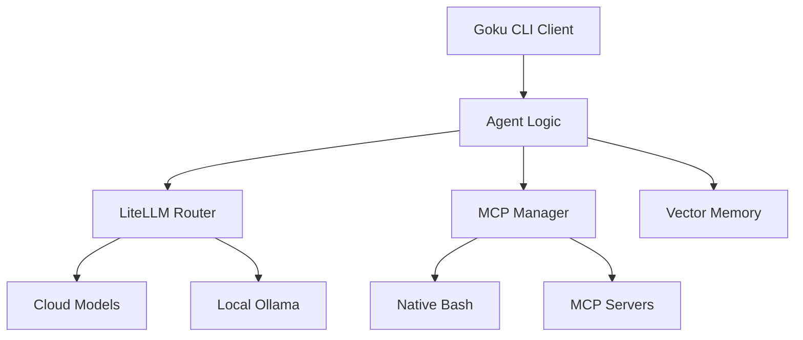

# Goku CLI Agent 🐉

Goku is a superior AI terminal agent designed for high-performance development workflows. It leverages MCP tools, vector memory, and hybrid model routing to solve complex tasks directly from your terminal.

## 🚀 Features
- **Pure CLI Experience**: Fast, minimalist, and powerful. No bloated UI or Docker required.
- **MCP Integration**: Seamlessly use Git, Search, and local Bash tools.
- **Vector Memory**: Learns from your workflows using Qdrant.
- **Hybrid Intelligence**: Routes to optimal models (OpenAI, Anthropic, or Local Ollama).

## 🏗️ Architecture



## 🛠️ Setup & Installation

### One-Liner Installation
Run the following command to install Goku globally on your system:

```bash
curl -sSL https://raw.githubusercontent.com/elvisthebuilder/gokuu/main/install.sh | bash
```

> [!NOTE]
> Make sure `~/.local/bin` is in your `PATH`. If not, add `export PATH="$PATH:$HOME/.local/bin"` to your `.bashrc` or `.zshrc`.

### 💻 Compatibility
- **Linux**: Fully supported (Ubuntu, Debian, Termux, etc.)
- **macOS**: Fully supported (Intel & Apple Silicon)
- **Windows**: Supported via **WSL** (Windows Subsystem for Linux)

## ⌨️ How to Use

### Terminal Interface (CLI)
Interact with Goku directly in your terminal with adaptive thoughts and tool execution.
```bash
goku cli
```

### Web Dashboard
Launch the high-fidelity web interface with real-time intelligence logs and a 70/30 split view.
```bash
goku web
```

## 🤝 Contributing
We welcome contributions! Please follow the standard fork and pull request workflow.

## 🛡️ Security & Safety
Goku is designed with a **Safety First** approach:
- **Thought Transparency**: See exactly why the agent is taking an action.
- **Local Control**: Runs natively in your environment without external containers.
