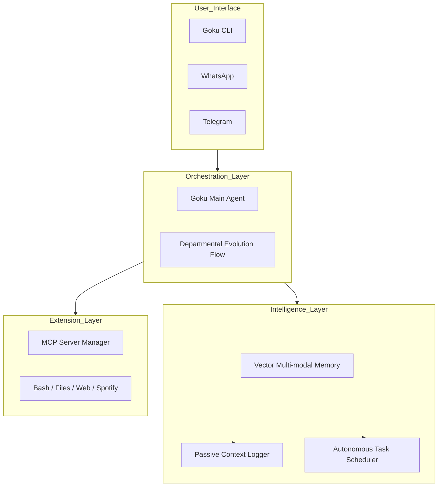

<div align="center">
  
  
  # Goku CLI Agent v3.0 🐉
  
  **The Sentient Update: Autonomous. Aware. Collaborative.**

  [](https://github.com/elvisthebuilder/gokuu)
  [](LICENSE)
  [](https://github.com/elvisthebuilder/gokuu/graphs/commit-activity)
  [](https://github.com/elvisthebuilder/gokuu)

  ---

  Goku is an elite terminal orchestrator that bridges the gap between static CLI tools and sentient-like agency. 
  By combining **Long-term Multimodal Memory**, **Passive Context Awareness**, and **Cross-Platform Delivery**, 
  Goku v3.0 empowers developers to automate the impossible.

  [Core Vision](#-core-vision) • [What's New](#-whats-new-in-v30) • [Architecture](#-architecture) • [Quick Start](#-quick-start)
</div>

## 🧠 Core Vision

Goku isn't just a bot; it's a **Departmental Pipeline**. It doesn't just "chat"—it researches, audits, and implements complex engineering tasks using specialized sub-agents. With the v3.0 "Sentient Update," Goku now "overhears" conversations to build background context, making it the most socially intelligent CLI agent in existence.

---

## 🚀 What's New in v3.0: *The Sentient Update*

### 👁️ **Passive Intelligence & "The Overhear System"**
Goku now maintains continuous awareness in your group chats. Even when you don't tag him, he records the background conversation into his vector memory.
- **Contextual Recall**: Ask him "@goku, what was the team's consensus on the database migration earlier?" and he'll know.
- **Silent Learning**: He builds situational context without interrupting your workflow.

### ⚡ **Autonomous Agency & Proactive Scheduling**
Goku is now proactive. He doesn't wait for your command to manage your world.
- **Recurring Jobs**: Schedule daily status reports, health checks, or greetings directly from Telegram or WhatsApp.
- **Owner-Exclusive Control**: Secure management via the `manage_schedules` tool, restricted to reaching the Owner's verified ID.

### 📱 **Unified Channel Interaction 2.0**
Deep integration with WhatsApp and Telegram with high-fidelity formatting.
- **Native Replies**: Goku now correctly identifies when someone replies to one of his messages.
- **Global Triggers**: Full support for `@all`, `@goku`, and custom trigger detection.
- **Premium ASCII UI**: High-resolution tables and clean markdown rendering optimized for mobile viewing.

---

## 🏗️ Architecture


```mermaid
graph TD
    subgraph User_Interface
        CLI[Goku CLI]
        WA[WhatsApp]
        TG[Telegram]
    end

    subgraph Orchestration_Layer
        Agent[Goku Main Agent]
        DEF[Departmental Evolution Flow]
    end

    subgraph Intelligence_Layer
        Memory[Vector Multi-modal Memory]
        Passive[Passive Context Logger]
        Scheduler[Autonomous Task Scheduler]
    end

    subgraph Extension_Layer
        MCP[MCP Server Manager]
        Tools[Bash / Files / Web / Spotify]
    end

    User_Interface --> Orchestration_Layer
    Orchestration_Layer --> Intelligence_Layer
    Orchestration_Layer --> Extension_Layer
    Intelligence_Layer --> Passive
    Intelligence_Layer --> Scheduler
```

---

## 🛠️ Quick Start

### 1. One-Liner Installation (Linux/macOS)
```bash
curl -sSL https://raw.githubusercontent.com/elvisthebuilder/gokuu/main/install.sh | bash
```

### 2. Connect Your Channels
```bash
goku setup
```
Follow the wizard to link your **WhatsApp (via QR)**, **Telegram (via BotFather)**, and your preferred AI brain (**OpenAI, Anthropic, Gemini, or Ollama**).

---

## ⌨️ Command Reference

<details>
<summary><b>View All Commands</b></summary>

| Command | Description |
| :--- | :--- |
| `goku chat` | Open the interactive 3.0 terminal session |
| `goku logs` | View the main system audit logs |
| `goku channel logs` | Real-time debug logs for WhatsApp/Telegram |
| `goku persona` | Interactive wizard to switch or create AI personalities |
| `goku update` | Sync everything to the latest v3.0 stable build |
| `goku start/stop` | Manage the background Gateway daemon |

</details>

---

## 👔 Professional Guidelines

To maximize Goku's high-fidelity capabilities, we recommend:
1. **Explicit Scheduling**: Give specific time-frames (e.g., "Every Friday at 4 PM, audit the `/src` folder").
2. **Persona Alignment**: Use `/persona` to switch to a *Senior Architect* for code reviews or *DevOps Lead* for infrastructure.
3. **Owner Security**: Always set your Owner Number in `goku config` to prevent unauthorized scheduling in public groups.

---

<div align="center">
  Built with ❤️ by [Elvisthebuilder](https://github.com/elvisthebuilder) and the Goku Community.
  
  [Report a Bug](https://github.com/elvisthebuilder/gokuu/issues) • [Request a Feature](https://github.com/elvisthebuilder/gokuu/discussions)
</div>
