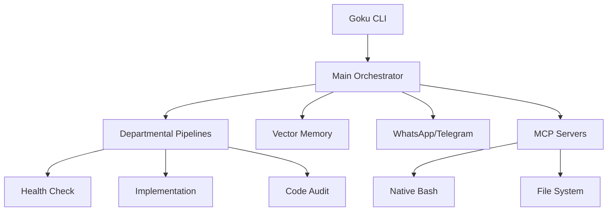

# Goku CLI Agent v3.0 🐉

Goku is an intelligent terminal agent designed for high-performance development and workflow orchestration. It leverages MCP tools, long-term vector memory, and multi-agent "Departmental" pipelines to solve complex tasks directly from your terminal, WhatsApp, or Telegram.

## 🚀 What's New in v3.0: The Sentient Update
- **Passive Intelligence & "The Overhear System"**: Goku now maintains continuous awareness in group chats, recording background context into memory even when not directly addressed.
- **Group Interaction 2.0**: Enhanced support for direct replies, `@all` tags, and contextual triggers across WhatsApp and Telegram.
- **Autonomous Group Tasks**: Schedule recurring agent actions (proactive status updates, greetings, reports) directly within channels.
- **Persistent Multimodal Memory**: Cross-persona memory isolation using Gemini Embedding 2, supporting text, images, and complex document types.
- **All-in-One Gateway Daemon**: Headless background service for silent, reliable connectivity.
- **Professional Diagnostic Suite**: `goku logs` and `goku channel logs` for deep observability.

## 👔 Professional Guidelines for Users

To get the most out of Goku v2.5, follow these professional communication standards:

1. **Be Explicit with Goals**: When scheduling autonomous tasks, provide clear instructions. Instead of "Say hi," use "Every morning at 8 AM, provide a brief, professional greeting and ask the team for their top three priorities."
2. **Utilize Context**: Mention specific folders or project names. Goku uses a vector memory system; referencing keywords helps him retrieve the right implementation plans.
3. **Confirm sensitive plans**: While Goku is autonomous, use the `manage_tasks` and `request_user_approval` tools to review complex changes before final implementation.
4. **Persona Alignment**: Switch to the right persona for the task (e.g., use a "Senior Architect" persona for code reviews and a "Project Manager" persona for scheduling).
5. **Security First**: If scheduling tasks, ensure you are communicating from your registered **Owner** number. Goku will reject management commands from unauthorized users.

## 🏗️ Architecture


```mermaid
graph TD
    CLI[Goku CLI] --> Agent[Main Orchestrator]
    Agent --> DEF[Departmental Pipelines]
    Agent --> Memory[Vector Memory]
    Agent --> Channel[WhatsApp/Telegram]
    
    DEF --> Health[Health Check]
    DEF --> Implement[Implementation]
    DEF --> Audit[Code Audit]
    
    Agent --> MCP[MCP Servers]
    MCP --> Bash[Native Bash]
    MCP --> Files[File System]
```

## 🛠️ Setup & Installation

### 1. One-Liner Installation
```bash
curl -sSL https://raw.githubusercontent.com/elvisthebuilder/gokuu/main/install.sh | bash
```

### 2. Configuration (.env)
After installation, Goku creates a `.env` file in the root. Configure your essential keys:
- `GEMINI_API_KEY`: Required for intelligence and multimodal memory.
- `TELEGRAM_BOT_TOKEN`: Your bot token from [@BotFather](https://t.me/botfather).
- `GOKU_OWNER_NUMBER`: Your phone number (e.g., `233...`) to authorize management commands.
- `WHATSAPP_GROUP_POLICY`: Set to `mentions` (default) or `all`.

### 3. Channel Linking
- **Telegram**: Simply start your bot after setting the token.
- **WhatsApp**: Run `goku start`. Check the logs with `goku logs` or look in `uploads/whatsapp_qr.png` to scan the QR code with your phone.

> [!NOTE]
> Make sure `~/.local/bin` is in your `PATH`. If not, add `export PATH="$PATH:$HOME/.local/bin"` to your `.bashrc` or `.zshrc`.

## ⌨️ How to Use

### Global Commands
- `goku cli`      - Start the interactive terminal agent
- `goku web`      - Launch the high-fidelity web dashboard
- `goku logs`     - View diagnostic logs (WhatsApp/Telegram activity)
- `goku channel logs` - View filtered bot-specific logs
- `goku update`   - Pull the latest version and re-install
- `goku start`    - Start the background bots (Gateway)
- `goku stop`     - Stop the background bots
- `goku status`   - Check background bot status

### 🤖 Intelligent Features
- **Persona Management**: Send `/persona` in any chat to interactively create or switch Goku's personality (e.g., "Senior Dev", "Life Coach").
- **Autonomous Scheduling**: As the "Boss," tell Goku: *"Every day at 8 AM, give a dynamic Good Morning message in this group."*
- **Memory Recall**: Goku automatically indexes shared images and documents. Ask him: *"What was in that architecture diagram I sent yesterday?"*
- **Departmental Flow**: For complex tasks, Goku will automatically spawn sub-agents (Health, Audit, Implement) to ensure high-quality execution.


## 🛡️ Security & Safety
Goku is designed with a **Safety First** approach:
- **Thought Transparency**: See exactly why the agent is taking an action in real-time.
- **Local Control**: Runs natively in your environment without external containers (except for memory).
- **Human-in-the-Loop**: Interactive confirmation for sensitive tool executions.

## 🛠️ Troubleshooting

### Docker Permissions
If you see a `permission denied` error when starting Goku, it's likely because your user doesn't have permission to manage Docker containers. You can resolve this by:
1. Adding your user to the `docker` group: `sudo usermod -aG docker $USER`
2. Applying the changes: `newgrp docker`

Alternatively, Goku will automatically prompt for `sudo` if it detects a permission issue.

## 🤝 Contributing
We welcome contributions! Please follow the standard fork and pull request workflow.
