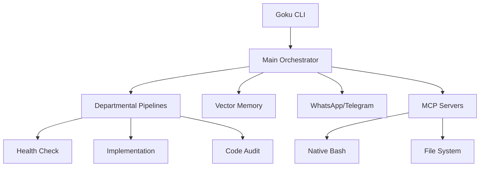

# Goku CLI Agent v2.5 🐉

Goku is an intelligent terminal agent designed for high-performance development and workflow orchestration. It leverages MCP tools, long-term vector memory, and multi-agent "Departmental" pipelines to solve complex tasks directly from your terminal, WhatsApp, or Telegram.

## 🚀 What's New in v2.5
- **Persistent Multimodal Memory**: Goku now remembers text, images, and documents (PDF/Docx) across restarts. Using Gemini Embedding 2, memories are isolated per persona, ensuring no data leakage between AI personalities.
- **Qdrant Auto-Pilot**: The vector engine now starts automatically via Docker when needed, with persistent storage mapped to `~/.goku-agent/qdrant_data`.
- **Channel-Specific Personalities**: Assign customized LLM system prompts (personas) to specific users or channels natively via the new `/persona` interactive command.
- **All-in-One Background Gateway**: A robust, headless `systemd` daemon that runs WhatsApp, Telegram, and JobTracker pollers silently in the background.
- **Departmental Evolution Flow (DEF)**: A multi-agent pipeline system (Health, Audit, Implement, Research) for complex engineering tasks.
- **Premium Messaging Design**: High-fidelity ASCII tables and bulletproof markdown for WhatsApp and Telegram.
- **Diagnostic Logging**: Clean CLI experience with persistent file-based logging (`goku logs`).

## 🏗️ Architecture


```mermaid
graph TD
    CLI[Goku CLI] --> Agent[Main Orchestrator]
    Agent --> DEF[Departmental Pipelines]
    Agent --> Memory[Vector Memory]
    Agent --> Channel[WhatsApp/Telegram]
    
    DEF --> Health[Health Check]
    DEF --> Implement[Implementation]
    DEF --> Audit[Code Audit]
    
    Agent --> MCP[MCP Servers]
    MCP --> Bash[Native Bash]
    MCP --> Files[File System]
```

## 🛠️ Setup & Installation

### One-Liner Installation
Run the following command to install Goku globally on your system:

```bash
curl -sSL https://raw.githubusercontent.com/elvisthebuilder/gokuu/main/install.sh | bash
```

> [!NOTE]
> Make sure `~/.local/bin` is in your `PATH`. If not, add `export PATH="$PATH:$HOME/.local/bin"` to your `.bashrc` or `.zshrc`.

## ⌨️ How to Use

### Global Commands
- `goku cli`      - Start the interactive terminal agent
- `goku web`      - Launch the high-fidelity web dashboard
- `goku logs`     - View diagnostic logs (WhatsApp/Telegram activity)
- `goku update`   - Pull the latest version and re-install
- `goku start`    - Start the background bots (Gateway)
- `goku stop`     - Stop the background bots
- `goku status`   - Check background bot status


## 🛡️ Security & Safety
Goku is designed with a **Safety First** approach:
- **Thought Transparency**: See exactly why the agent is taking an action in real-time.
- **Local Control**: Runs natively in your environment without external containers (except for memory).
- **Human-in-the-Loop**: Interactive confirmation for sensitive tool executions.

## 🛠️ Troubleshooting

### Docker Permissions
If you see a `permission denied` error when starting Goku, it's likely because your user doesn't have permission to manage Docker containers. You can resolve this by:
1. Adding your user to the `docker` group: `sudo usermod -aG docker $USER`
2. Applying the changes: `newgrp docker`

Alternatively, Goku will automatically prompt for `sudo` if it detects a permission issue.

## 🤝 Contributing
We welcome contributions! Please follow the standard fork and pull request workflow.
